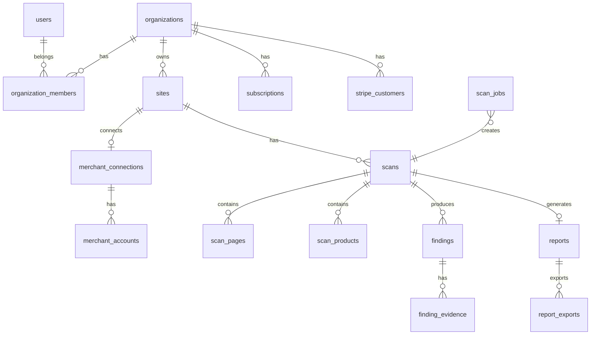

# Shopping Rescue — Database Schema

> Version: 1.0.0 · Last updated: 2026-07-12

## 1. Conventions

| Convention | Value |
|---|---|
| Primary keys | `UUID` via `gen_random_uuid()` |
| Timestamps | `created_at`, `updated_at` (auto-trigger) |
| Soft delete | `deleted_at` where applicable |
| Tenant isolation | `organization_id` on all tenant tables |
| Naming | `snake_case` tables and columns |
| Secrets | Never stored in plaintext; refresh tokens encrypted at app layer |
| Migrations | Versioned SQL in `packages/database/migrations/` |

---

## 2. Entity Relationship Overview



---

## 3. Tables

### 3.1 `users`

Synced from Supabase Auth. Extended profile data.

```sql
CREATE TABLE users (
  id            UUID PRIMARY KEY,          -- matches auth.users.id
  email         TEXT NOT NULL UNIQUE,
  full_name     TEXT,
  locale        TEXT NOT NULL DEFAULT 'en',
  avatar_url    TEXT,
  role          TEXT NOT NULL DEFAULT 'user',  -- user | admin
  created_at    TIMESTAMPTZ NOT NULL DEFAULT now(),
  updated_at    TIMESTAMPTZ NOT NULL DEFAULT now(),
  deleted_at    TIMESTAMPTZ
);
```

### 3.2 `organizations`

```sql
CREATE TABLE organizations (
  id            UUID PRIMARY KEY DEFAULT gen_random_uuid(),
  name          TEXT NOT NULL,
  slug          TEXT NOT NULL UNIQUE,
  plan          TEXT NOT NULL DEFAULT 'free',  -- free | full_audit | monitoring_pro | agency
  plan_limits   JSONB,                         -- override per-org if needed
  is_suspended  BOOLEAN NOT NULL DEFAULT false,
  white_label   BOOLEAN NOT NULL DEFAULT false,
  created_at    TIMESTAMPTZ NOT NULL DEFAULT now(),
  updated_at    TIMESTAMPTZ NOT NULL DEFAULT now(),
  deleted_at    TIMESTAMPTZ
);
```

### 3.3 `organization_members`

```sql
CREATE TABLE organization_members (
  id              UUID PRIMARY KEY DEFAULT gen_random_uuid(),
  organization_id UUID NOT NULL REFERENCES organizations(id),
  user_id         UUID NOT NULL REFERENCES users(id),
  role            TEXT NOT NULL DEFAULT 'member',  -- owner | member
  invited_by      UUID REFERENCES users(id),
  joined_at       TIMESTAMPTZ NOT NULL DEFAULT now(),
  created_at      TIMESTAMPTZ NOT NULL DEFAULT now(),
  UNIQUE (organization_id, user_id)
);
```

### 3.4 `sites`

```sql
CREATE TABLE sites (
  id                UUID PRIMARY KEY DEFAULT gen_random_uuid(),
  organization_id   UUID NOT NULL REFERENCES organizations(id),
  url               TEXT NOT NULL,
  normalized_url    TEXT NOT NULL,
  name              TEXT,
  platform          TEXT,           -- shopify | woocommerce | magento | custom | unknown
  country           TEXT,           -- ISO 3166-1 alpha-2
  mc_issue_type     TEXT,           -- suspension | misrepresentation | website_improvement | product_disapproval | other
  review_requests   INTEGER DEFAULT 0,
  ownership_status  TEXT NOT NULL DEFAULT 'unverified',  -- unverified | email_confirmed | merchant_connected
  is_active         BOOLEAN NOT NULL DEFAULT true,
  created_at        TIMESTAMPTZ NOT NULL DEFAULT now(),
  updated_at        TIMESTAMPTZ NOT NULL DEFAULT now(),
  deleted_at        TIMESTAMPTZ,
  UNIQUE (organization_id, normalized_url)
);
```

### 3.5 `site_ownership_checks`

```sql
CREATE TABLE site_ownership_checks (
  id              UUID PRIMARY KEY DEFAULT gen_random_uuid(),
  site_id         UUID NOT NULL REFERENCES sites(id),
  method          TEXT NOT NULL,     -- email | merchant_oauth
  status          TEXT NOT NULL DEFAULT 'pending',  -- pending | confirmed | expired | failed
  token_hash      TEXT,              -- for email confirmation link
  expires_at      TIMESTAMPTZ,
  confirmed_at    TIMESTAMPTZ,
  created_at      TIMESTAMPTZ NOT NULL DEFAULT now()
);
```

### 3.6 `merchant_connections`

```sql
CREATE TABLE merchant_connections (
  id                    UUID PRIMARY KEY DEFAULT gen_random_uuid(),
  organization_id       UUID NOT NULL REFERENCES organizations(id),
  site_id               UUID REFERENCES sites(id),
  google_account_email  TEXT NOT NULL,
  refresh_token_enc     TEXT NOT NULL,   -- AES-256-GCM encrypted
  access_token_enc      TEXT,            -- short-lived, encrypted
  token_expires_at      TIMESTAMPTZ,
  scopes                TEXT[] NOT NULL DEFAULT '{https://www.googleapis.com/auth/content}',
  status                TEXT NOT NULL DEFAULT 'active',  -- active | expired | revoked
  last_sync_at          TIMESTAMPTZ,
  created_at            TIMESTAMPTZ NOT NULL DEFAULT now(),
  updated_at            TIMESTAMPTZ NOT NULL DEFAULT now(),
  deleted_at            TIMESTAMPTZ
);
```

### 3.7 `merchant_accounts`

```sql
CREATE TABLE merchant_accounts (
  id                      UUID PRIMARY KEY DEFAULT gen_random_uuid(),
  merchant_connection_id  UUID NOT NULL REFERENCES merchant_connections(id),
  google_account_id       TEXT NOT NULL,    -- MC account ID
  account_name            TEXT,
  account_type            TEXT,
  is_selected             BOOLEAN NOT NULL DEFAULT false,
  raw_data                JSONB,
  last_synced_at          TIMESTAMPTZ,
  created_at              TIMESTAMPTZ NOT NULL DEFAULT now(),
  updated_at              TIMESTAMPTZ NOT NULL DEFAULT now(),
  UNIQUE (merchant_connection_id, google_account_id)
);
```

### 3.8 `stripe_customers`

```sql
CREATE TABLE stripe_customers (
  id                UUID PRIMARY KEY DEFAULT gen_random_uuid(),
  organization_id   UUID NOT NULL REFERENCES organizations(id) UNIQUE,
  stripe_customer_id TEXT NOT NULL UNIQUE,
  email             TEXT NOT NULL,
  created_at        TIMESTAMPTZ NOT NULL DEFAULT now(),
  updated_at        TIMESTAMPTZ NOT NULL DEFAULT now()
);
```

### 3.9 `subscriptions`

```sql
CREATE TABLE subscriptions (
  id                      UUID PRIMARY KEY DEFAULT gen_random_uuid(),
  organization_id         UUID NOT NULL REFERENCES organizations(id),
  stripe_subscription_id  TEXT NOT NULL UNIQUE,
  stripe_customer_id      TEXT NOT NULL,
  plan                    TEXT NOT NULL,    -- monitoring_pro | agency
  status                  TEXT NOT NULL,    -- active | past_due | canceled | trialing | incomplete
  current_period_start    TIMESTAMPTZ,
  current_period_end      TIMESTAMPTZ,
  cancel_at_period_end    BOOLEAN NOT NULL DEFAULT false,
  trial_end               TIMESTAMPTZ,
  created_at              TIMESTAMPTZ NOT NULL DEFAULT now(),
  updated_at              TIMESTAMPTZ NOT NULL DEFAULT now()
);
```

### 3.10 `one_time_purchases`

```sql
CREATE TABLE one_time_purchases (
  id                      UUID PRIMARY KEY DEFAULT gen_random_uuid(),
  organization_id         UUID NOT NULL REFERENCES organizations(id),
  site_id                 UUID REFERENCES sites(id),
  scan_id                 UUID REFERENCES scans(id),
  stripe_payment_intent_id TEXT,
  stripe_checkout_session_id TEXT UNIQUE,
  plan                    TEXT NOT NULL DEFAULT 'full_audit',
  amount_cents            INTEGER NOT NULL,
  currency                TEXT NOT NULL DEFAULT 'eur',
  status                  TEXT NOT NULL DEFAULT 'pending',  -- pending | completed | refunded
  created_at              TIMESTAMPTZ NOT NULL DEFAULT now(),
  updated_at              TIMESTAMPTZ NOT NULL DEFAULT now()
);
```

### 3.11 `scan_jobs`

Persistent job queue.

```sql
CREATE TABLE scan_jobs (
  id              UUID PRIMARY KEY DEFAULT gen_random_uuid(),
  organization_id UUID REFERENCES organizations(id),
  site_id         UUID REFERENCES sites(id),
  scan_id         UUID REFERENCES scans(id),
  job_type        TEXT NOT NULL,
  status          TEXT NOT NULL DEFAULT 'queued',
  priority        INTEGER NOT NULL DEFAULT 0,
  attempts        INTEGER NOT NULL DEFAULT 0,
  max_attempts    INTEGER NOT NULL DEFAULT 3,
  idempotency_key TEXT UNIQUE,
  payload         JSONB NOT NULL DEFAULT '{}',
  progress        INTEGER NOT NULL DEFAULT 0,   -- 0-100
  error_message   TEXT,
  scheduled_at    TIMESTAMPTZ NOT NULL DEFAULT now(),
  started_at      TIMESTAMPTZ,
  completed_at    TIMESTAMPTZ,
  timeout_at      TIMESTAMPTZ,
  created_at      TIMESTAMPTZ NOT NULL DEFAULT now(),
  updated_at      TIMESTAMPTZ NOT NULL DEFAULT now()
);

CREATE INDEX idx_scan_jobs_poll ON scan_jobs (status, scheduled_at)
  WHERE status = 'queued';
```

### 3.12 `scans`

```sql
CREATE TABLE scans (
  id                UUID PRIMARY KEY DEFAULT gen_random_uuid(),
  organization_id   UUID REFERENCES organizations(id),
  site_id           UUID NOT NULL REFERENCES sites(id),
  scan_type         TEXT NOT NULL,    -- free | full | monitoring
  status            TEXT NOT NULL DEFAULT 'pending',
  risk_score        INTEGER,          -- 0-100
  risk_level        TEXT,             -- low | moderate | elevated | high | critical
  confidence_level  TEXT,             -- low | medium | high
  pages_crawled     INTEGER DEFAULT 0,
  products_analyzed INTEGER DEFAULT 0,
  rules_version     TEXT,
  previous_scan_id  UUID REFERENCES scans(id),
  is_report_unlocked BOOLEAN NOT NULL DEFAULT false,
  started_at        TIMESTAMPTZ,
  completed_at      TIMESTAMPTZ,
  expires_at        TIMESTAMPTZ,
  created_at        TIMESTAMPTZ NOT NULL DEFAULT now(),
  updated_at        TIMESTAMPTZ NOT NULL DEFAULT now()
);
```

### 3.13 `scan_pages`

```sql
CREATE TABLE scan_pages (
  id              UUID PRIMARY KEY DEFAULT gen_random_uuid(),
  scan_id         UUID NOT NULL REFERENCES scans(id) ON DELETE CASCADE,
  url             TEXT NOT NULL,
  normalized_url  TEXT NOT NULL,
  page_type       TEXT,              -- home | contact | product | policy | other
  http_status     INTEGER,
  redirect_chain  JSONB,
  title           TEXT,
  meta_description TEXT,
  language        TEXT,
  content_hash    TEXT,
  json_ld         JSONB,
  visible_text    TEXT,
  screenshot_path TEXT,              -- Supabase Storage path
  response_time_ms INTEGER,
  crawled_at      TIMESTAMPTZ NOT NULL DEFAULT now(),
  UNIQUE (scan_id, normalized_url)
);
```

### 3.14 `scan_products`

```sql
CREATE TABLE scan_products (
  id              UUID PRIMARY KEY DEFAULT gen_random_uuid(),
  scan_id         UUID NOT NULL REFERENCES scans(id) ON DELETE CASCADE,
  page_id         UUID REFERENCES scan_pages(id),
  url             TEXT NOT NULL,
  title           TEXT,
  price           NUMERIC(12,2),
  currency        TEXT,
  availability    TEXT,
  json_ld_price   NUMERIC(12,2),
  json_ld_availability TEXT,
  image_url       TEXT,
  description     TEXT,
  platform_data   JSONB,
  created_at      TIMESTAMPTZ NOT NULL DEFAULT now()
);
```

### 3.15 `merchant_account_issues`

```sql
CREATE TABLE merchant_account_issues (
  id                  UUID PRIMARY KEY DEFAULT gen_random_uuid(),
  merchant_account_id UUID NOT NULL REFERENCES merchant_accounts(id),
  scan_id             UUID REFERENCES scans(id),
  issue_id            TEXT NOT NULL,
  severity            TEXT,
  title               TEXT,
  detail              TEXT,
  documentation_url   TEXT,
  raw_data            JSONB,
  synced_at           TIMESTAMPTZ NOT NULL DEFAULT now(),
  UNIQUE (merchant_account_id, issue_id, scan_id)
);
```

### 3.16 `merchant_product_issues`

```sql
CREATE TABLE merchant_product_issues (
  id                  UUID PRIMARY KEY DEFAULT gen_random_uuid(),
  merchant_account_id UUID NOT NULL REFERENCES merchant_accounts(id),
  scan_id             UUID REFERENCES scans(id),
  product_id          TEXT NOT NULL,
  product_title       TEXT,
  issue_code          TEXT,
  severity            TEXT,
  detail              TEXT,
  raw_data            JSONB,
  synced_at           TIMESTAMPTZ NOT NULL DEFAULT now()
);
```

### 3.17 `rule_definitions`

```sql
CREATE TABLE rule_definitions (
  id                    TEXT NOT NULL,       -- e.g. BI-001
  version               INTEGER NOT NULL,
  category              TEXT NOT NULL,
  title                 TEXT NOT NULL,
  description           TEXT NOT NULL,
  severity              TEXT NOT NULL,
  confidence_method     TEXT NOT NULL,
  evidence_requirements JSONB NOT NULL DEFAULT '[]',
  remediation_template  TEXT NOT NULL,
  policy_reference      TEXT,
  enabled               BOOLEAN NOT NULL DEFAULT true,
  published_at          TIMESTAMPTZ NOT NULL DEFAULT now(),
  PRIMARY KEY (id, version)
);
```

### 3.18 `findings`

```sql
CREATE TABLE findings (
  id              UUID PRIMARY KEY DEFAULT gen_random_uuid(),
  scan_id         UUID NOT NULL REFERENCES scans(id) ON DELETE CASCADE,
  rule_id         TEXT NOT NULL,
  rule_version    INTEGER NOT NULL,
  title           TEXT NOT NULL,
  category        TEXT NOT NULL,
  severity        TEXT NOT NULL,
  confidence      NUMERIC(3,2) NOT NULL,   -- 0.00 - 1.00
  affected_url    TEXT,
  evidence        JSONB NOT NULL DEFAULT '{}',
  explanation     TEXT NOT NULL,
  recommendation  TEXT NOT NULL,
  status          TEXT NOT NULL DEFAULT 'open',
  is_ai_assisted  BOOLEAN NOT NULL DEFAULT false,
  created_at      TIMESTAMPTZ NOT NULL DEFAULT now(),
  updated_at      TIMESTAMPTZ NOT NULL DEFAULT now()
);

CREATE INDEX idx_findings_scan ON findings (scan_id);
CREATE INDEX idx_findings_severity ON findings (scan_id, severity);
```

### 3.19 `finding_evidence`

```sql
CREATE TABLE finding_evidence (
  id          UUID PRIMARY KEY DEFAULT gen_random_uuid(),
  finding_id  UUID NOT NULL REFERENCES findings(id) ON DELETE CASCADE,
  type        TEXT NOT NULL,    -- screenshot | text_excerpt | json_ld | url | merchant_data
  content     JSONB NOT NULL,
  source_url  TEXT,
  created_at  TIMESTAMPTZ NOT NULL DEFAULT now()
);
```

### 3.20 `reports`

```sql
CREATE TABLE reports (
  id              UUID PRIMARY KEY DEFAULT gen_random_uuid(),
  scan_id         UUID NOT NULL REFERENCES scans(id) UNIQUE,
  organization_id UUID NOT NULL REFERENCES organizations(id),
  summary         TEXT,
  narrative       TEXT,              -- AI-generated narrative (optional)
  checklist       JSONB,
  comparison      JSONB,             -- diff with previous scan
  is_full_access  BOOLEAN NOT NULL DEFAULT false,
  visible_findings INTEGER,          -- for free tier: 2
  created_at      TIMESTAMPTZ NOT NULL DEFAULT now(),
  updated_at      TIMESTAMPTZ NOT NULL DEFAULT now()
);
```

### 3.21 `report_exports`

```sql
CREATE TABLE report_exports (
  id          UUID PRIMARY KEY DEFAULT gen_random_uuid(),
  report_id   UUID NOT NULL REFERENCES reports(id),
  export_type TEXT NOT NULL,    -- pdf | readiness_pack | csv
  file_path   TEXT,             -- Supabase Storage path
  file_size   INTEGER,
  status      TEXT NOT NULL DEFAULT 'pending',
  created_at  TIMESTAMPTZ NOT NULL DEFAULT now(),
  completed_at TIMESTAMPTZ
);
```

### 3.22 `notification_preferences`

```sql
CREATE TABLE notification_preferences (
  id                UUID PRIMARY KEY DEFAULT gen_random_uuid(),
  user_id           UUID NOT NULL REFERENCES users(id),
  organization_id   UUID NOT NULL REFERENCES organizations(id),
  scan_completed    BOOLEAN NOT NULL DEFAULT true,
  critical_alerts   BOOLEAN NOT NULL DEFAULT true,
  weekly_summary    BOOLEAN NOT NULL DEFAULT true,
  marketing         BOOLEAN NOT NULL DEFAULT false,
  created_at        TIMESTAMPTZ NOT NULL DEFAULT now(),
  updated_at        TIMESTAMPTZ NOT NULL DEFAULT now(),
  UNIQUE (user_id, organization_id)
);
```

### 3.23 `email_events`

```sql
CREATE TABLE email_events (
  id          UUID PRIMARY KEY DEFAULT gen_random_uuid(),
  user_id     UUID REFERENCES users(id),
  email       TEXT NOT NULL,
  template    TEXT NOT NULL,
  status      TEXT NOT NULL,    -- sent | failed | bounced
  resend_id   TEXT,
  metadata    JSONB,
  created_at  TIMESTAMPTZ NOT NULL DEFAULT now()
);
```

### 3.24 `usage_counters`

```sql
CREATE TABLE usage_counters (
  id                UUID PRIMARY KEY DEFAULT gen_random_uuid(),
  organization_id   UUID NOT NULL REFERENCES organizations(id),
  period_start      DATE NOT NULL,
  period_end        DATE NOT NULL,
  scans_count       INTEGER NOT NULL DEFAULT 0,
  pages_crawled     INTEGER NOT NULL DEFAULT 0,
  ai_tokens_used    INTEGER NOT NULL DEFAULT 0,
  ai_cost_cents     INTEGER NOT NULL DEFAULT 0,
  created_at        TIMESTAMPTZ NOT NULL DEFAULT now(),
  UNIQUE (organization_id, period_start)
);
```

### 3.25 `audit_logs`

```sql
CREATE TABLE audit_logs (
  id              UUID PRIMARY KEY DEFAULT gen_random_uuid(),
  organization_id UUID REFERENCES organizations(id),
  user_id         UUID REFERENCES users(id),
  action          TEXT NOT NULL,
  resource_type   TEXT,
  resource_id     UUID,
  metadata        JSONB,
  ip_address      INET,
  created_at      TIMESTAMPTZ NOT NULL DEFAULT now()
);

CREATE INDEX idx_audit_logs_org ON audit_logs (organization_id, created_at DESC);
```

### 3.26 `webhook_events`

```sql
CREATE TABLE webhook_events (
  id              UUID PRIMARY KEY DEFAULT gen_random_uuid(),
  provider        TEXT NOT NULL,    -- stripe | google
  event_id        TEXT NOT NULL,
  event_type      TEXT NOT NULL,
  payload         JSONB NOT NULL,
  status          TEXT NOT NULL DEFAULT 'received',  -- received | processed | failed
  error_message   TEXT,
  processed_at    TIMESTAMPTZ,
  created_at      TIMESTAMPTZ NOT NULL DEFAULT now(),
  UNIQUE (provider, event_id)
);
```

### 3.27 `system_settings`

```sql
CREATE TABLE system_settings (
  key         TEXT PRIMARY KEY,
  value       JSONB NOT NULL,
  description TEXT,
  updated_by  UUID REFERENCES users(id),
  updated_at  TIMESTAMPTZ NOT NULL DEFAULT now()
);
```

**Default seed values:**

```json
{
  "plans.free_scan": { "max_pages": 15, "max_products": 20, "visible_findings": 2 },
  "plans.full_audit": { "price_cents": 7900, "max_pages": 150, "max_products": 500, "retention_months": 12 },
  "plans.monitoring_pro": { "price_cents": 4900, "max_sites": 3, "scan_interval_days": 7 },
  "plans.agency": { "price_cents": 19900, "max_sites": 20, "scan_interval_days": 7 },
  "retention.free_scan_days": 30,
  "retention.free_screenshot_days": 7,
  "retention.paid_report_months": 12,
  "retention.logs_days": 90
}
```

---

## 4. Row Level Security

### Principle

All tenant data isolated by `organization_id`. Users access only organizations they belong to.

### Example policies

```sql
-- sites: members can read their org's sites
CREATE POLICY sites_select ON sites FOR SELECT
  USING (organization_id IN (
    SELECT organization_id FROM organization_members
    WHERE user_id = auth.uid()
  ));

-- scan_jobs: no direct client access (service role only)
ALTER TABLE scan_jobs ENABLE ROW LEVEL SECURITY;
-- No policies for authenticated users — worker uses service role

-- findings: readable if user has access to the scan's organization
CREATE POLICY findings_select ON findings FOR SELECT
  USING (scan_id IN (
    SELECT s.id FROM scans s
    JOIN organization_members om ON om.organization_id = s.organization_id
    WHERE om.user_id = auth.uid()
  ));
```

### Service role usage

| Context | Role |
|---|---|
| Web API routes (server) | `service_role` for job creation, webhooks |
| Worker | `service_role` for all DB operations |
| Client (browser) | `anon` / `authenticated` with RLS |

---

## 5. Indexes Summary

| Table | Index | Purpose |
|---|---|---|
| `scan_jobs` | `(status, scheduled_at) WHERE queued` | Job polling |
| `scans` | `(site_id, created_at DESC)` | Scan history |
| `findings` | `(scan_id, severity)` | Report rendering |
| `sites` | `(organization_id)` | Dashboard listing |
| `subscriptions` | `(organization_id, status)` | Entitlement check |
| `webhook_events` | `(provider, event_id)` | Idempotency |
| `audit_logs` | `(organization_id, created_at DESC)` | Admin audit |

---

## 6. Job Queue Functions

```sql
-- Claim next job (worker polling)
CREATE OR REPLACE FUNCTION claim_next_job(worker_id TEXT)
RETURNS SETOF scan_jobs AS $$
  UPDATE scan_jobs
  SET status = 'running', started_at = now(), updated_at = now()
  WHERE id = (
    SELECT id FROM scan_jobs
    WHERE status = 'queued'
      AND scheduled_at <= now()
      AND (timeout_at IS NULL OR timeout_at > now())
    ORDER BY priority DESC, scheduled_at ASC
    LIMIT 1
    FOR UPDATE SKIP LOCKED
  )
  RETURNING *;
$$ LANGUAGE sql;
```

---

## 7. Data Retention Jobs

`DELETE_EXPIRED_DATA` job runs daily:

1. Soft-delete free scans older than `retention.free_scan_days`
2. Delete screenshot files older than `retention.free_screenshot_days`
3. Archive paid reports past `retention.paid_report_months`
4. Purge `audit_logs` older than `retention.logs_days`
5. Log deletions in `audit_logs`

---

## 8. Migration Strategy

1. Migrations in `packages/database/migrations/NNNN_description.sql`
2. Applied via `pnpm db:migrate` (Drizzle Kit or custom runner)
3. Seed via `packages/database/seed/dev.sql`
4. Never destructive migrations without explicit backup step in docs
