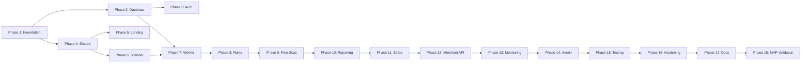

# Shopping Rescue — Implementation Plan

> Version: 1.0.0 · Last updated: 2026-07-12

## Overview

This document defines the phased implementation plan for Shopping Rescue MVP. Each phase produces working, testable software. Phases are sequential but some tasks within a phase can run in parallel.

**Estimated total:** 18 phases · MVP target: phases 1–14

---

## Phase 1: Foundation ✅ (current)

**Goal:** Project structure, documentation, monorepo skeleton.

| Task | Status |
|---|---|
| Create `docs/PRODUCT_SPEC.md` | ✅ |
| Create `docs/ARCHITECTURE.md` | ✅ |
| Create `docs/DATABASE.md` | ✅ |
| Create `docs/SECURITY.md` | ✅ |
| Create `docs/IMPLEMENTATION_PLAN.md` | ✅ |
| Initialize pnpm monorepo | ✅ |
| Configure Turborepo | ✅ |
| TypeScript strict base config | ✅ |
| Create all package scaffolds | ✅ |
| Create `apps/web` Next.js skeleton | ✅ |
| Create `apps/worker` skeleton | ✅ |
| `.env.example` | ✅ |
| `docker-compose.yml` | ✅ |
| Root README | ✅ |

**Verification:** `pnpm install && pnpm build` succeeds.

---

## Phase 2: Database

**Goal:** Schema deployed, migrations working, seed data.

| Task | Deliverable |
|---|---|
| Set up Drizzle ORM in `packages/database` | Schema definitions |
| Write migration `0001_initial_schema.sql` | All tables from DATABASE.md |
| Write migration `0002_rls_policies.sql` | RLS for tenant tables |
| Write migration `0003_job_functions.sql` | `claim_next_job()` |
| Seed `system_settings` with plan defaults | Configurable plans |
| Seed `rule_definitions` v1 (core rules) | ~30 initial rules |
| Seed dev user + org | Local development |
| Scripts: `db:migrate`, `db:seed`, `db:reset` | package.json scripts |

**Verification:** `pnpm db:migrate && pnpm db:seed` — all tables exist with seed data.

---

## Phase 3: Authentication

**Goal:** Users can sign up, log in, manage sessions.

| Task | Deliverable |
|---|---|
| Supabase project setup guide | `docs/SUPABASE_SETUP.md` |
| `packages/auth` — server/client helpers | Session management |
| Sign up / login pages | `/signup`, `/login` |
| Auth middleware | Protected routes |
| User sync trigger | `auth.users` → `users` table |
| Organization auto-creation on signup | Default org for new users |
| CSRF token generation | `@shopping-rescue/auth` |

**Verification:** User can sign up, log in, access `/dashboard`, session persists.

---

## Phase 4: Shared Infrastructure

**Goal:** Core utilities used by web and worker.

| Task | Deliverable |
|---|---|
| `packages/shared` — Zod schemas | All domain types |
| Plan limits resolver | `getPlanLimits(plan)` |
| URL normalizer | With tests |
| Encryption utils | AES-256-GCM |
| Structured logger | JSON + correlation ID |
| `packages/ui` — shadcn setup | Button, Card, Input, etc. |
| Design tokens | Navy/white/gray palette |
| i18n setup (next-intl) | `/en`, `/fr` routing |

**Verification:** Unit tests pass for URL normalizer, encryption, plan limits.

---

## Phase 5: Landing & Public Pages

**Goal:** Marketing site with free scan entry point.

| Task | Deliverable |
|---|---|
| Landing page (`/`) | Hero, sections, disclaimer |
| `/pricing` | Plan comparison |
| `/free-scan` | URL + metadata form |
| `/how-it-works` | Process explanation |
| `/faq`, `/contact` | Support pages |
| SEO landing pages (5) | MC issue-specific |
| Legal pages (5) | Terms, privacy, etc. |
| Cookie banner | Consent management |
| `robots.txt`, `sitemap.xml` | SEO |
| Layout + navigation | Responsive, i18n |

**Verification:** All public pages render, disclaimer visible, i18n switches work.

---

## Phase 6: Scanner & SSRF Protection

**Goal:** Crawler can safely scan a public website.

| Task | Deliverable |
|---|---|
| `packages/scanner` — URL validator | SSRF protection + tests |
| Robots.txt parser | Respect disallow |
| Sitemap discovery | Auto-find sitemap |
| Playwright page crawler | Internal links, priority pages |
| Content extractor | Text, JSON-LD, meta |
| Screenshot capture | Important pages |
| Platform detector | Shopify, WooCommerce, etc. |
| Plan limit enforcement | Max pages/products per plan |

**Verification:** Unit tests for SSRF. Integration test: crawl a test site, get pages + products.

---

## Phase 7: Worker & Job Queue

**Goal:** Background jobs execute reliably.

| Task | Deliverable |
|---|---|
| `apps/worker` — main loop | Poll + claim jobs |
| Job handlers registry | Type → handler mapping |
| `FREE_SITE_SCAN` handler | Enqueue → scan → rules → report |
| `FULL_SITE_SCAN` handler | Extended crawl |
| Job retry with backoff | Exponential + jitter |
| Progress reporting | Update `scan_jobs.progress` |
| Health check endpoint | `:3001/health` |
| Graceful shutdown | Finish current job before exit |
| Docker setup for worker | Playwright + Chromium |

**Verification:** Enqueue a job via API, worker processes it, scan record created.

---

## Phase 8: Rules Engine

**Goal:** Deterministic analysis produces findings and score.

| Task | Deliverable |
|---|---|
| `packages/rules-engine` — registry | Load rules from DB |
| Rule evaluator framework | `evaluate(page, product, context)` |
| Implement core rules (~30) | All categories from spec |
| Score calculator | Weighted, capped per rule |
| Finding generator | Map rule results → findings |
| AI-assisted evaluator (optional) | `AIProvider` interface + fallback |
| Rules version tracking | Store version on scan |

**Verification:** Unit tests for scoring, rule evaluation. Integration: scan → findings → score.

---

## Phase 9: Free Scan Flow (E2E)

**Goal:** Complete visitor journey from URL to partial report.

| Task | Deliverable |
|---|---|
| `POST /api/scans` — create free scan | Validate, enqueue job |
| Progress page | Real-time status polling |
| Scan completion handler | Update scan status |
| Partial report view | Score + 2 findings + locked rest |
| Email: scan completed | Resend template |
| Visitor email collection | Before revealing results |

**Verification:** E2E test: submit URL → wait → see score + 2 findings → receive email.

---

## Phase 10: Reporting

**Goal:** Full reports viewable on web and downloadable as PDF.

| Task | Deliverable |
|---|---|
| `packages/reporting` — web report | All sections from spec |
| Report page `/dashboard/reports/[id]` | Full UI |
| Checklist component | Prioritized, mark as fixed |
| Scan comparison | Before/after diff |
| PDF generation | `@react-pdf/renderer` |
| Review Readiness Pack | ZIP with corrections summary |
| `GENERATE_REPORT` job handler | Auto-generate after scan |
| `GENERATE_PDF` job handler | Async PDF creation |

**Verification:** Full report renders all sections. PDF downloads. Readiness pack generates.

---

## Phase 11: Stripe Billing

**Goal:** Payments unlock features automatically.

| Task | Deliverable |
|---|---|
| Stripe setup guide | `docs/STRIPE_SETUP.md` |
| `packages/billing` — checkout | One-time + subscription sessions |
| Webhook handler | Idempotent event processing |
| Plan entitlement resolver | Check org plan + limits |
| `/pricing` → Checkout flow | Full Audit + subscriptions |
| `/dashboard/billing` | Portal link, current plan |
| Billing Portal integration | Manage subscription |
| Emails: payment confirmed, failed | Resend templates |
| Unlock report on payment | Webhook → `is_report_unlocked` |

**Verification:** Stripe test mode: pay → webhook → report unlocked. Subscription activates monitoring.

---

## Phase 12: Merchant Center Integration

**Goal:** OAuth connection and issue sync.

| Task | Deliverable |
|---|---|
| Google Cloud setup guide | `docs/GOOGLE_OAUTH_SETUP.md` |
| `packages/merchant-api` — client | Adapter pattern |
| OAuth flow (initiate + callback) | State validation, token encryption |
| Account listing + selection | UI in `/dashboard/integrations` |
| `accounts.issues.list` | Account issues sync |
| Product listing + issues | Product-level problems |
| `MERCHANT_SYNC` job handler | Scheduled + on-demand |
| MC-specific rules | Price/availability mismatch |
| Disconnect + token revocation | Clean removal |
| Email: connection expired | Alert template |

**Verification:** Connect test MC account → issues synced → MC findings in report.

---

## Phase 13: Monitoring & Alerts

**Goal:** Recurring scans and notifications for subscribers.

| Task | Deliverable |
|---|---|
| Weekly scan scheduler | Cron → `WEEKLY_MONITORING_SCAN` |
| Scan comparison engine | New/resolved/changed findings |
| Alert emails | Critical, new issue, resolved |
| Weekly summary email | Digest template |
| Dashboard history | Scan timeline per site |
| Manual re-scan with rate limit | Plan-enforced |
| `/dashboard/sites/[siteId]` | Store detail + history |

**Verification:** Schedule weekly scan → executes → comparison → alert if new critical issue.

---

## Phase 14: Admin & Observability

**Goal:** Admin can monitor system; errors are tracked.

| Task | Deliverable |
|---|---|
| Admin dashboard | System health, failed jobs |
| Job retry from admin | Manual re-queue |
| Rule management UI | Enable/disable, publish version |
| Plan config UI | Edit `system_settings` |
| Sentry integration | Web + worker |
| Structured logging | Correlation IDs |
| Health check endpoints | Web + worker |
| `DELETE_EXPIRED_DATA` job | Daily cleanup |
| Deployment guides | Railway + Render |
| GDPR: export + deletion | User settings |

**Verification:** Admin can see failed jobs and retry. Sentry captures errors. Health checks respond.

---

## Phase 15: Testing

**Goal:** Critical paths covered by automated tests.

### Unit tests (Vitest)

| Module | Tests |
|---|---|
| URL normalizer | Valid, invalid, edge cases |
| SSRF validator | Private IPs, localhost, redirects |
| Score calculator | Weighting, capping, levels |
| Rules engine | Individual rule evaluation |
| Plan limits | Per-plan enforcement |
| Webhook verification | Stripe signature |
| Token encryption | Encrypt/decrypt round-trip |
| Scan diff | Before/after comparison |
| Merchant API parser | Response normalization |
| OAuth refresh | Token renewal logic |

### Integration tests

| Flow | Coverage |
|---|---|
| Free scan E2E | Submit → process → report |
| Stripe one-time | Checkout → webhook → unlock |
| Stripe subscription | Subscribe → webhook → activate |
| MC OAuth (mocked) | Connect → sync → findings |
| MC API errors | 401, 429, 5xx handling |
| Disconnect | Revoke → clean state |

### E2E tests (Playwright)

Full user journey: visit → scan → email → pay → unlock → signup → connect MC → rescan → download.

**Verification:** `pnpm test` — all critical tests green.

---

## Phase 16: Production Hardening

| Task | Deliverable |
|---|---|
| CSP fine-tuning | No violations in production |
| Rate limiting (Redis) | Upstash integration |
| Load testing | Scanner under concurrent scans |
| Error page handling | 404, 500, maintenance |
| Performance audit | Lighthouse > 90 on landing |
| Security review | Checklist from SECURITY.md |

---

## Phase 17: Documentation & Deployment

| Document | Content |
|---|---|
| `README.md` | Quick start, architecture overview |
| `docs/DEPLOYMENT.md` | Railway/Render step-by-step |
| `docs/SUPABASE_SETUP.md` | Project creation, RLS, storage |
| `docs/STRIPE_SETUP.md` | Products, prices, webhooks |
| `docs/GOOGLE_OAUTH_SETUP.md` | Cloud Console, consent screen |
| `.env.example` | All variables documented |

**Verification:** Fresh clone → follow README → local dev running in < 15 min.

---

## Phase 18: MVP Validation

Final checklist from PRODUCT_SPEC §9:

- [ ] Public scan launchable and executed in background
- [ ] Real report produced and stored
- [ ] Completion email sent
- [ ] Stripe Test Mode payment unlocks report
- [ ] Subscription activates monitoring
- [ ] MC connectable in test environment
- [ ] Account + product issues retrievable
- [ ] PDF downloadable
- [ ] Weekly scan schedulable
- [ ] Critical tests pass
- [ ] Local startup documented
- [ ] Deployment guides complete

---

## Dependency Graph



---

## Commit Strategy

Each phase should produce 1–3 logical commits:

```
feat(foundation): initialize monorepo with pnpm workspaces
feat(database): add initial schema migration and seed data
feat(auth): implement Supabase auth with organization creation
feat(scanner): add Playwright crawler with SSRF protection
feat(rules): implement deterministic rules engine v1
feat(worker): add PostgreSQL job queue and scan handlers
feat(billing): integrate Stripe checkout and webhooks
feat(merchant): add Google OAuth and Merchant API v1 client
feat(monitoring): add weekly scans and alert emails
test: add unit and e2e tests for critical paths
docs: add deployment and configuration guides
```

---

## Risk Register

| Risk | Impact | Mitigation |
|---|---|---|
| Playwright in Docker | Large image, slow builds | Multi-stage Dockerfile, browser cache |
| Merchant API quota | Sync failures | Backoff, partial sync, degraded mode |
| AI cost overrun | Budget blow | Token limits, cost tracking, fallback |
| SSRF vulnerability | Security breach | Comprehensive validator + tests |
| Stripe webhook delay | User waits for unlock | Polling + webhook, never redirect-only |
| Site blocks crawler | Incomplete scan | Partial results + clear messaging |
