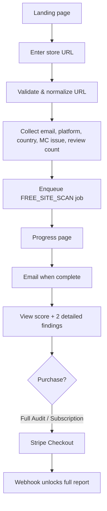
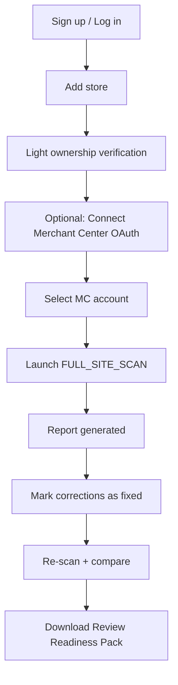

# Shopping Rescue — Product Specification

> Version: 1.0.0 · Status: MVP · Last updated: 2026-07-12

## 1. Vision

**Shopping Rescue** is an independent SaaS that helps e-commerce merchants diagnose likely causes of Google Merchant Center issues: account suspensions, Misrepresentation warnings, "Website needs improvement", product disapprovals, and inconsistencies between their storefront and Merchant Center data.

The product operates **fully self-service** — no human administrator involvement in normal client processing.

### What we provide

| Deliverable | Description |
|---|---|
| Factual observations | Evidence collected from public site crawl and Merchant API |
| Risk score | 0–100 deterministic score with confidence level |
| Probable causes | Ranked findings with severity and category |
| Evidence | URLs, screenshots, structured data excerpts |
| Recommendations | Actionable remediation per finding |
| Correction checklist | Prioritized task list |
| Downloadable report | Web + PDF + Review Readiness Pack |
| Recurring monitoring | Weekly scans with alerts (paid plans) |

### What we never do

- Guarantee account reinstatement
- Claim affiliation with Google
- Claim certainty about suspension causes when Google does not disclose them
- Automatically submit review requests to Google
- Automatically modify Merchant Center accounts
- Request Google or Shopify passwords

### Mandatory disclaimer

> **Shopping Rescue is an independent service and is not affiliated with, endorsed by, or sponsored by Google. Results are diagnostic recommendations and do not guarantee account reinstatement.**

Displayed on: landing page, report pages, PDF exports, emails, legal pages. No Google logo or visual identity imitation.

---

## 2. Pricing Plans

All prices, limits, and intervals are configurable via `system_settings` table and environment variables.

| Plan | Price (default) | Billing |
|---|---|---|
| **Free Scan** | €0 | — |
| **Full Audit** | €79 | One-time |
| **Monitoring Pro** | €49/mo | Subscription |
| **Agency** | €199/mo | Subscription |

### Free Scan

| Feature | Limit |
|---|---|
| URL input + validation | ✓ |
| Public site crawl | 15 pages max |
| Products analyzed | 20 max |
| Global risk score | ✓ |
| Issue count by severity | ✓ |
| Detailed findings shown | 2 only |
| Email required before results | ✓ |
| Full report | Locked |

### Full Audit

| Feature | Limit |
|---|---|
| Crawl depth | 150 pages |
| Products analyzed | 500 |
| Full report + evidence + URLs | ✓ |
| Prioritized checklist | ✓ |
| Correction suggestions | ✓ |
| Commercial page templates | ✓ |
| Free re-scan after corrections | ✓ |
| PDF download | ✓ |
| Report access | 12 months |

### Monitoring Pro

Everything in Full Audit, plus:

| Feature | Limit |
|---|---|
| Automatic weekly scan | ✓ |
| Merchant Center OAuth connection | ✓ |
| Account issues sync | ✓ |
| Product status + issues sync | ✓ |
| Scan comparison (before/after) | ✓ |
| Email alerts | ✓ |
| Scan history | ✓ |
| Stores | 3 max |
| Manual re-scan | Rate-limited |

### Agency

Everything in Monitoring Pro, plus:

| Feature | Limit |
|---|---|
| Stores | 20 max |
| Multi-client workspace | ✓ |
| White-label reports (optional) | ✓ |
| Collaborator invitations | ✓ |
| CSV export | ✓ |
| Centralized alerts | ✓ |

### Payment infrastructure

- **Stripe Checkout** for one-time and subscription payments
- **Stripe Billing Portal** for payment method, invoices, plan changes, cancellation
- **Stripe webhooks** as source of truth for plan activation
- Never activate a plan based solely on post-payment redirect

---

## 3. User Journeys

### 3.1 Visitor (Free Scan)

### 3.2 Subscriber

**Ownership verification** (light, not required for public scan):
- Email confirmation, OR
- Merchant Center OAuth connection

---

## 4. Core Features

### 4.1 Site Scanner

- Playwright-based crawler in dedicated worker process
- SSRF protection, robots.txt respect, transparent user-agent
- Priority pages: home, contact, about, legal, shipping, returns, privacy, TOS, FAQ, cart, collections, products
- Extracts: visible text, JSON-LD, metadata, screenshots, content hash, language, platform detection

### 4.2 Rules Engine

- Deterministic, versioned rule definitions
- Categories: Business identity, Shipping, Returns/refunds, Products, Site quality, Trust/representation, Merchant data consistency
- AI used only for: ambiguous text classification, policy summarization, contradiction detection, plain-language explanations, personalized suggestions, translation, narrative report
- AI never invents problems or decides critical severity alone

### 4.3 Risk Scoring

| Severity | Points |
|---|---|
| critical | 20 |
| high | 10 |
| medium | 4 |
| low | 1 |

Score capped per rule to prevent 500-product repetition from dominating.

| Range | Label |
|---|---|
| 0–19 | Low detected risk |
| 20–39 | Moderate |
| 40–59 | Elevated |
| 60–79 | High |
| 80–100 | Critical |

Separate confidence level: low / medium / high.

### 4.4 Merchant Center Integration

- Google Merchant API **v1** (not v1beta)
- OAuth 2.0 web server flow, scope: `https://www.googleapis.com/auth/content`
- Offline access, encrypted refresh tokens, CSRF state, PKCE where supported
- Useful even without MC connection (public scan only)

### 4.5 Reports

Web report + PDF + Review Readiness Pack containing:
1. Summary, score, limitations warning
2. Issues by severity (critical → info)
3. MC account + product issues
4. Evidence, URLs, checklist, recommended order
5. Comparison with previous scan
6. Rules engine version, official sources, disclaimer

Each finding: detection, why it matters, evidence, URL, confidence, recommendation, "Mark as fixed", "Re-scan".

---

## 5. Pages & Routes

### Public (localized: `/en`, `/fr`)

| Route | Purpose |
|---|---|
| `/` | Landing page |
| `/pricing` | Plans comparison |
| `/free-scan` | Start free scan |
| `/how-it-works` | Product explanation |
| `/sample-report` | Example report |
| `/merchant-center-suspended` | SEO landing |
| `/merchant-center-misrepresentation` | SEO landing |
| `/website-needs-improvement` | SEO landing |
| `/product-disapprovals` | SEO landing |
| `/shopify-merchant-center` | SEO landing |
| `/faq`, `/help`, `/contact` | Support |
| `/login`, `/signup` | Auth |
| `/legal/*` | Terms, privacy, cookies, refunds, disclaimer |

### Dashboard (authenticated)

| Route | Purpose |
|---|---|
| `/dashboard` | Overview |
| `/dashboard/sites` | Store list |
| `/dashboard/sites/[siteId]` | Store detail |
| `/dashboard/scans/[scanId]` | Scan results |
| `/dashboard/reports/[reportId]` | Full report |
| `/dashboard/integrations` | MC OAuth |
| `/dashboard/billing` | Stripe portal |
| `/dashboard/settings` | Preferences |

### Admin (role-protected)

System health, failed jobs, plan config, rule management, AI costs, webhook failures, account suspension, data deletion.

---

## 6. Emails (Resend)

| Template | Trigger |
|---|---|
| scan_confirmation | Scan queued |
| scan_in_progress | Scan started |
| scan_completed | Scan finished |
| report_available | Report ready |
| payment_confirmed | One-time purchase |
| subscription_activated | Subscription started |
| payment_failed | Payment failure |
| critical_issue_detected | Critical finding |
| new_issue_since_last_scan | Regression |
| issue_resolved | Finding marked fixed |
| merchant_connection_expired | OAuth token expired |
| weekly_summary | Monitoring digest |
| subscription_cancelled | Cancellation |
| data_deletion_completed | GDPR deletion done |

All emails: secure dashboard link, no sensitive data, preference management link.

---

## 7. Data Retention (configurable)

| Data type | Default retention |
|---|---|
| Unconverted free scan | 30 days |
| Free scan screenshots | 7 days |
| Paid report | 12 months |
| Subscription data | Subscription duration + legal period |
| Technical logs | 30–90 days |

---

## 8. Degraded Mode

Product remains functional when:

| Failure | Fallback |
|---|---|
| AI unavailable | Deterministic report only |
| Merchant API down | Public site scan only |
| Email fails | Retry job, in-app notification |
| PDF generation fails | Web report still available |
| Playwright blocked | Partial scan with clear message |
| OAuth refused | Site-only analysis |

---

## 9. MVP Acceptance Criteria

- [ ] Public scan can be launched and executed in background worker
- [ ] Real report produced and stored
- [ ] Completion email sent
- [ ] Stripe Test Mode: payment unlocks report via webhook
- [ ] Subscription activates monitoring via webhook
- [ ] Merchant Center connectable in test environment
- [ ] Account + product issues retrievable
- [ ] PDF downloadable
- [ ] Weekly scan schedulable
- [ ] Critical tests pass
- [ ] Local startup documented and working
- [ ] Deployment guides provided
